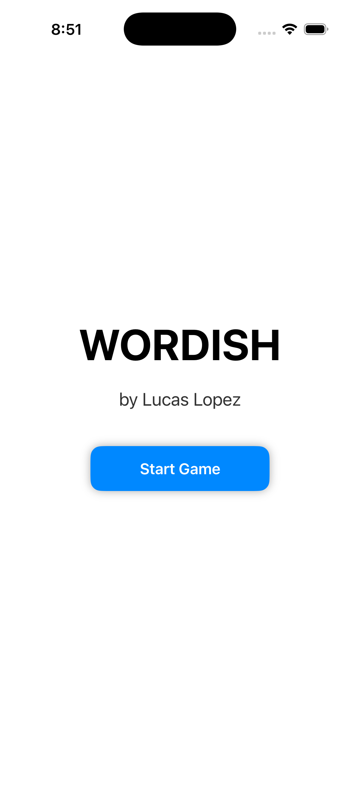
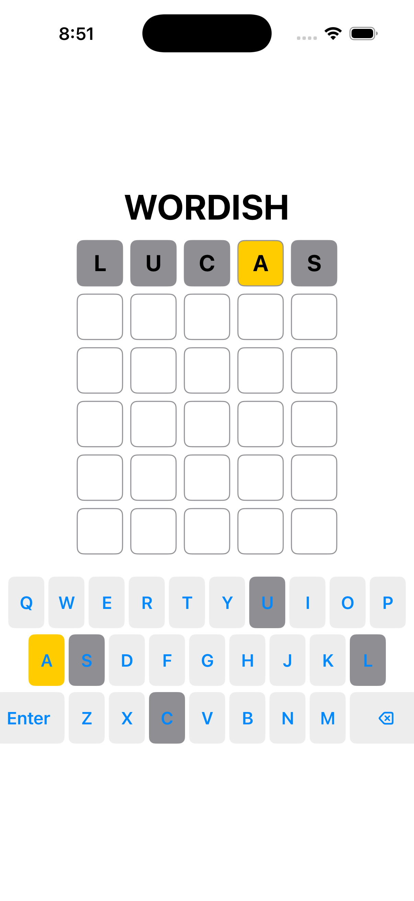

# Wordish – iOS Word Guessing Game 
*by Lucas Lopez*

*A Wordle-inspired iOS game built with SwiftUI, async/await networking, and clean MVVM architecture.*

<p align="left">

  
  
  
  
  

</p>

---

## Demo  

<p align="center">
  
</p>

---

## Overview  
**Wordish** is an iOS word-guessing game inspired by *Wordle*, recreated entirely in **SwiftUI** with clean architecture, smooth animations, and real-time API-driven word generation.

---

## Tech Stack

<p align="left">

  <!-- Language -->
  

  <!-- Framework -->
  

  <!-- Architecture -->
  

  <!-- Concurrency -->
  

  <!-- Networking -->
  

  <!-- API -->
  

  <!-- iOS Version -->
  

</p>

---

## Features  

### Core Gameplay
- Guess the 5-letter word in 6 attempts  
- Tile color feedback (🟩 correct, 🟨 present, ⬜️ absent)  
- Dynamic on-screen keyboard with matching colors  
- Delete + Enter functionality  
- Win/Loss screen with solution reveal  

### UI & Interaction
- Smooth keypress animation  
- Color fade transitions  
- Intro splash screen  
- Loading overlay while fetching new words
- Custom animated start screen to introduce the game

### API Integration
- Fetches random 5-letter words using:  
  `https://random-word-api.vercel.app/api?words=1&length=5`  
- Async/await word fetch with automatic fallback  

---

## Screenshots  

<p align="center">
  
  
</p>

<p align="center">
  <em>Left: Start Game screen | Right: Gameplay screen</em>
</p>

---

## Architecture

### MVVM Breakdown
| Layer | Role |
|-------|------|
| **Model** | Represents tiles, rows, and letter states |
| **ViewModel** | Game logic, evaluation, keyboard coloring, API calls |
| **Views** | Grid, keyboard, overlays, intro screen |

### Networking  
- `WordService` implemented as an **actor** for concurrency safety  
- Uses `URLSession` + `async/await`  
- Decodes the API’s JSON response (array) and extracts a single uppercase secret word

### Custom Views
- `ContentView`
  - Main game screen containing the grid, keyboard, overlays, and app title
  - Hosts the GameViewModel via @StateObject
  - Manages intro screen visibility, loading overlay, and win/lose UI
- `KeyboardView`
  - Fully custom on-screen keyboard
  - Arranged in three dynamic rows (QWERTY layout)
  - Each key updates its color based on guess history (absent/present/correct)
  - Calls back into the ViewModel for input, delete, and submit actions
- `Tile Rendering (inside ContentView)`
  - Each tile displays a letter or empty state
  - Background color reflects evaluation state (unknown, correct, present, absent)
  - Built using RoundedRectangle + overlayed text
- `Loading Overlay`
  - Uses SwiftUI’s ProgressView
  - Dimmed background to block interaction during API fetch
- `Intro Screen`
  - Custom splash/start screen
  - Animated fade-out transition using .easeInOut
  - Prevents game UI from showing underneath

---

## Installation

### Requirements
- Xcode 15+  
- iOS 17+  
- Swift 5.9  

### Steps
1. Clone the repo
    ```bash
    git clone https://github.com/lucastricanico/wordish-ios-app.git
    ```
2. Open in Xcode
3. Run the Project
4. Don't forget to have fun! :)

---

## Project Structure
```bash
Wordish/
│
├── Models/
│   └── GameModels.swift
│
├── ViewModels/
│   └── GameViewModel.swift
│
├── Services/
│   └── WordService.swift
│
├── Views/
│   ├── ContentView.swift
│   └── KeyboardView.swift
│
├── Screenshots/
│   ├── demo.gif
│   ├── start_screen.png
│   └── game_screen.png
│
├── Wordish/
│   ├── Assets.xcassets
│   └── WordishApp.swift
│
├── Wordish.xcodeproj
│
├── README.md
├── LICENSE
└── .gitignore
```

---

## Credits 
This project is a personal project inspired by Wordle.
- Wordle was originally created by *Josh Wardle*.
- It is now owned and published by *The New York Times Company*.

Wordish is an independent project and is not affiliated with, endorsed by, or associated with The New York Times or the official Wordle product.
This project is non-commercial and built for learning + portfolio purposes.

---

## Future Improvements
### Gameplay
- Tile flip animation (like Wordle)
- Shake animation for invalid words
- Real dictionary validation

### UX Enhancements
- Haptic feedback
- Dark mode
- Success/Failure animations

### Stats & Meta
- Guess distribution
- Win streak
- Shareable result grid

---

## License
Released under the MIT License.

See LICENSE for details.
